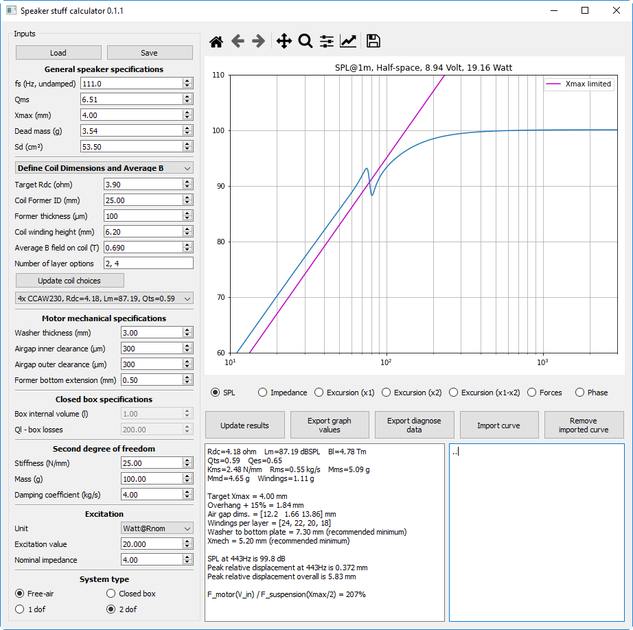

## Speaker Stuff Calculator
**Calculation tool for loudspeaker design**  
Written for Python 3.7.  
Employs Numpy, Pandas, Matplotlib, and PySide2.

**Features:**
* Modelling of loudspeaker response in free-air and closed box.
  * SPL, electrical impedance, displacements, net forces
* Automatic calculation of most appropriate coil winding for given user parameters.
  * Wire properties are read from user editable "WIRE_TABLE.csv".
  * Possible to calculate for different types of wire section (round, flat, etc.)
* Includes a second degree of freedom to observe the effects on parent structure.
* Possible to manipulate graph settings and import/export curves.
* Calculation of magnet system mechanical clearances.
* Possible to save/load state.

**Not features:**
* Nonlinearities in the system
* Calculation of magnetic flux
* Calculation of moving mass of components (with the exception of the coil)
* Electrical inductance
* Change of acoustical impedance in higher frequencies

**Screenshot:**  

